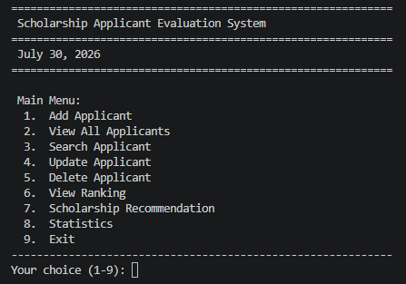
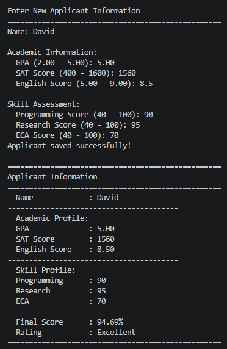
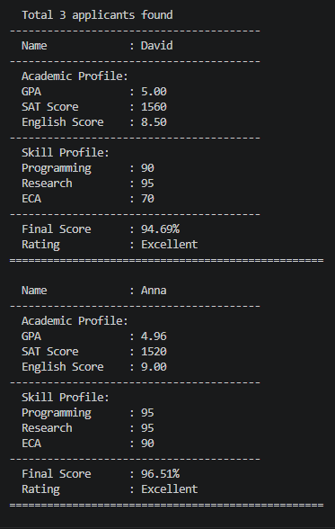
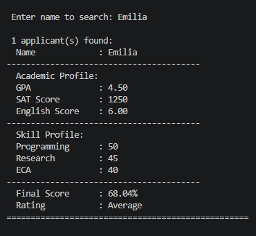
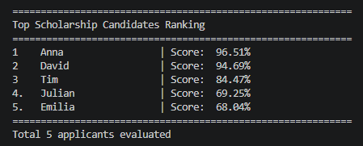
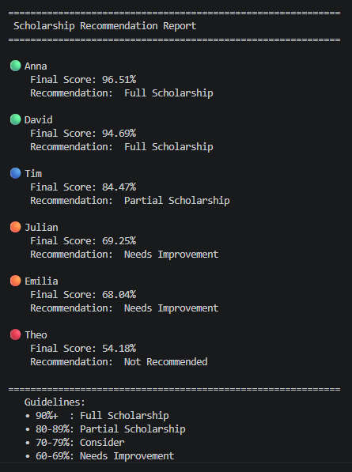
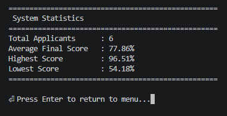

# 🎓 Scholarship Applicant Evaluation System

A professional **Command-Line Interface (CLI)** application developed using **Python 3** that evaluates scholarship applicants using a weighted scoring algorithm.

This project simulates a real-world scholarship evaluation process where applicants are assessed based on academic performance, programming skills, research ability, English proficiency, and extracurricular activities. The system supports complete CRUD operations, applicant ranking, scholarship recommendations, statistical reports, and JSON-based data persistence.

---

# 📌 Project Overview

The **Scholarship Applicant Evaluation System** is a menu-driven Python application designed to demonstrate how a real-world scholarship selection process can be implemented using core Python concepts.

The project focuses on writing **clean, readable, maintainable, and modular code** while following professional programming practices such as input validation, exception handling, documentation, reusable functions, and JSON data storage.

This project is part of my Python Developer Portfolio.

---

## 🚀 Quick Preview

- 👨‍🎓 Add Applicant
- 📋 View All Applicants
- 🔍 Search Applicant
- ✏️ Update Applicant
- 🗑️ Delete Applicant
- 🧮 Automatic Score Calculation
- 🏆 Applicant Ranking
- 🎓 Scholarship Recommendation
- 📊 Statistics Dashboard
- 💾 JSON Data Persistence
---

# ✨ Features

- 👨‍🎓 Add Applicant
- 📋 View All Applicants
- 🔍 Search Applicant
- ✏️ Update Applicant Information
- 🗑 Delete Applicant
- 🏆 Applicant Ranking System
- 🎓 Scholarship Recommendation
- 📊 Statistics Report
- 💾 JSON Data Persistence
- ✅ Input Validation
- ⚠️ Exception Handling
- 📚 Function Docstrings
- ⚙️ Configurable Score Weights
- ⭐ Applicant Rating System
- 📅 Current Date Display
- 🎯 Professional CLI Interface

---

# 🧮 Evaluation Criteria

Applicants are evaluated using a weighted scoring system.

| Criteria | Weight |
|-----------|--------|
| GPA | 30% |
| SAT Score | 20% |
| English Score | 10% |
| Programming | 20% |
| Research | 15% |
| Extra-Curricular Activities (ECA) | 5% |

All scores are normalized before calculating the final weighted score.

---

# 🏆 Scholarship Recommendation

| Final Score | Recommendation |
|-------------|---------------|
| 90% - 100% | 🟢 Full Scholarship |
| 80% - 89% | 🔵 Partial Scholarship |
| 70% - 79% | 🟡 Consider |
| 60% - 69% | 🟠 Needs Improvement |
| Below 60% | 🔴 Not Recommended |

---

# 📊 Statistics

The system automatically generates:

- Total Applicants
- Average Final Score
- Highest Score
- Lowest Score

---

# 🛠 Technologies Used

| Technology | Description |
|------------|-------------|
| Python 3 | Programming Language |
| JSON | Data Storage |
| CLI | Command-Line Interface |
| Dictionaries | Applicant Records |
| Lists | Data Management |
| File Handling | JSON Persistence |
| Exception Handling | Error Management |
| Functions | Modular Programming |

---

# 📂 Project Structure

```text
Scholarship-Applicant-Evaluation-System/
│
├── main.py
├── applicants.json
├── README.md
├── LICENSE
├── .gitignore
└── screenshots/
```

---

# ⚙️ Requirements

- Python 3.12 or later
- No external libraries required

---

# 🚀 Installation

Clone the repository

```bash
git clone https://github.com/ariful3551/Scholarship-Applicant-Evaluation-System.git
```

Move into the project folder

```bash
cd Scholarship-Applicant-Evaluation-System
```

Run the application

```bash
python main.py
```

---

# 💻 How to Use

1. Run the application.
2. Select an option from the main menu.
3. Add applicant information.
4. View, search, update, or delete applicants.
5. View applicant rankings.
6. Generate scholarship recommendations.
7. View system statistics.
8. Exit the application.

---

# 📸 Screenshots

### 🏠 Main Menu



### ➕ Add Applicant



### 📋 View All Applicants



### 🔍 Search Applicant



### 🏆 Ranking System



### 🎓 Scholarship Recommendation



### 📊 Statistics



---

# 📚 Learning Concepts

This project demonstrates practical knowledge of:

## Python Fundamentals

- Variables
- Data Types
- User Input
- Output Formatting
- Conditional Statements
- Loops
- Functions

## Intermediate Python

- Dictionaries
- Lists
- File Handling
- JSON
- Exception Handling
- Constants
- Modular Programming
- Reusable Functions
- Function Docstrings
- Data Validation

## Software Development

- CRUD Operations
- Search Algorithm
- Sorting
- Ranking System
- Statistics Generation
- Score Normalization
- Weighted Scoring Algorithm
- Data Persistence
- Menu-Driven Programming
- Professional CLI Design

---

# 🌟 Project Highlights

This project demonstrates:

- Clean Python Code
- Modular Architecture
- Professional Function Documentation
- Reusable Validation Functions
- JSON File Storage
- Weighted Scoring Algorithm
- Applicant Ranking
- Scholarship Recommendation
- Statistics Dashboard
- Professional Console User Interface

---

# 🚀 Future Improvements

Planned features for future versions:

- SQLite Database
- Admin Login
- Applicant Registration ID
- Scholarship Categories
- PDF Report Generation
- Excel Export
- Email Notification
- Tkinter GUI
- Flask Web Version
- Django Web Version
- Machine Learning-Based Scholarship Prediction

---

# 🗺️ Project Roadmap

## ✅ Version 1.0

- CRUD Operations
- JSON Storage
- Ranking System
- Recommendation Engine
- Statistics
- Input Validation

## 🔄 Version 2.0

- SQLite Database
- Improved Reports
- Better Searching
- Export Features

## 🚀 Version 3.0

- Object-Oriented Programming
- GUI Version
- Web Application
- AI-based Scholarship Prediction

---

# 👨‍💻 Author

**Ariful Islam**

Computer Science & Engineering Student

Passionate about Python, Data Analysis, Machine Learning, Artificial Intelligence, and Large Language Models (LLMs).

I enjoy building real-world software projects that improve my programming, software engineering, and problem-solving skills.

GitHub: https://github.com/ariful3551

---

# 🤝 Contributing

Contributions, suggestions, and feedback are always welcome.

If you would like to improve this project:

1. Fork the repository.
2. Create a feature branch.
3. Commit your changes.
4. Push your branch.
5. Open a Pull Request.

---

# 📄 License

This project is licensed under the **MIT License**.

You are free to use, modify, and distribute this project for educational and personal purposes.

---

# 📌 Project Status

**Current Version:** v1.0.0

**Status:** ✅ Active Development

This project is part of my Python learning journey and will continue to evolve with additional features and improvements.

---

# ⭐ Support

If you found this project useful, please consider giving it a ⭐ Star on GitHub.

Your support motivates me to continue learning and building more open-source software.

---

# 📚 More Projects Coming Soon

- 🏦 Mini Banking System
- 🏭 Smart Manufacturing Resource Planning System
- 📚 Student Management System
- 📦 Inventory Management System
- 📈 Data Analysis Projects
- 🤖 Machine Learning Projects
- 🧠 AI & LLM Engineering Projects

Stay tuned for more updates!

---

# ❤️ Thank You

Thank you for visiting this repository.

Happy Coding! 🚀

**Made with ❤️ by Ariful Islam**